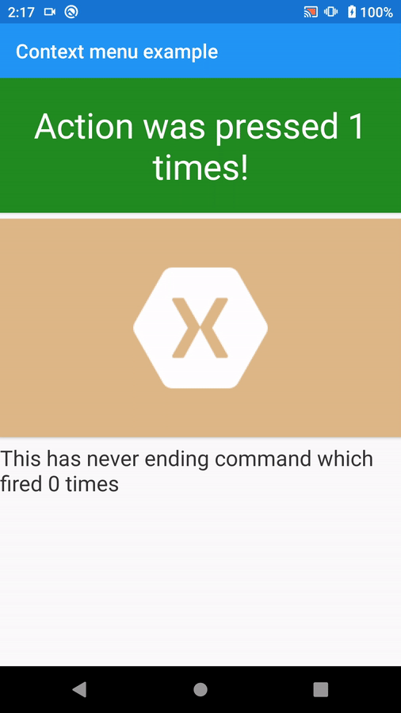

# ContextMenuContainer
[](https://www.nuget.org/packages/ContextMenuContainer/)
[](https://github.com/anpin/ContextMenuContainer/actions/workflows/main.yml)
[](https://paypal.me/APEngineeringLLC?locale.x=en_US)

Native context menu for any MAUI and Xamarin.Forms view. 
Supports Windows, Android, iOS and macOS.

iOS | Android | macOs | Windows
:-------------------------:|:-------------------------:|:-------------------------:|:-------------------------:
 |  |  | 
## How to use
1. Add namespace to your XAML file 
    `xmlns:apes="http://apes.ge"`
2. Add following line of code to your `App.xaml.cs` in order to preserve component during linking and resolve our namespace schema in XAML
```
    APES.UI.XF.ContextMenuContainer.Init();
```
3. Extra step for UWP: add our assembly to Xamarin.Forms external assemblies in your UWP `App.xaml.cs` 
```
    using System.Reflection;
    ...
    var extraAssemblies = new List<Assembly>();
    extraAssemblies.Add(typeof(APES.UI.XF.ContextMenuContainer).GetTypeInfo().Assembly);
    Xamarin.Forms.Forms.Init(e, extraAssemblies);
```
4. Wrap your view with `ContextMenuContainer`, define your context actions inline or bind from your ViewModel
```
//Inline
<apes:ContextMenuContainer x:Name="ActionsInline">
    <apes:ContextMenuContainer.MenuItems>
        <apes:ContextMenuItem Text="My action" 
                Command="{Binding MyCommand}" 
                CommandParameter="{Binding .}" />
        <apes:ContextMenuItem Text="My destructive action" 
                Command="{Binding MyDestructiveCommand}" 
                CommandParameter="{Binding .}" 
                IsDestructive="True" 
                Icon="{Binding DestructiveIconSource}"/>
    </apes:ContextMenuContainer.MenuItems>
    <apes:ContextMenuContainer.Content>
        <Label Text="Hold me!"/>
    </apes:ContextMenuContainer.Content>
</apes:ContextMenuContainer>
//From binding
<apes:ContextMenuContainer x:Name="ContextActionsWithBinding" 
                            MenuItems="{Binding ImageContextItems}">
    <apes:ContextMenuContainer.Content>
        <Frame>
            <Image Source="{Binding IconSource}"/>
        </Frame>
    </apes:ContextMenuContainer.Content>
</apes:ContextMenuContainer>
```

## Icons 
Cross-platform icons are really messy at this point, but you can put your assets to the coresponding folder on each platform and then bind to a `FileIconImageSource` from your ViewModel. Please refer to the sample folder for example. SVG is preferable.
## Known issues 
- Using it in a `ViewCell` template of `ListView` might lead to issues with recognizing tap/select events from the list itself, so you might consider using TapGestureRecognizer on the template instead

## To-Do
- [x] Configure build scripts
- [ ] Refactor MAUI initialization
- [ ] Add visibility property 
- [ ] Add highlight property 
- [ ] Add support for shortcuts 
- [ ] Add support of accessability features
- [ ] Add support for submenus and separators
- [ ] Add font icons
- [ ] Cover it all with tests

## If this plugin saves you time please consider donating via buttons below, so I can make it even better
[](https://paypal.me/APEngineeringLLC?locale.x=en_US)


